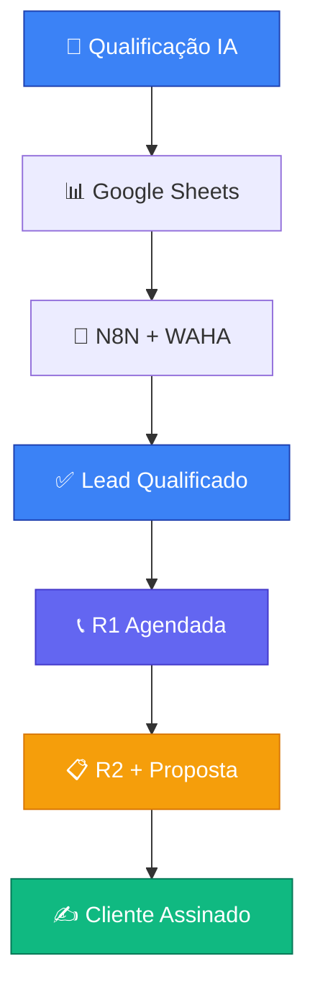
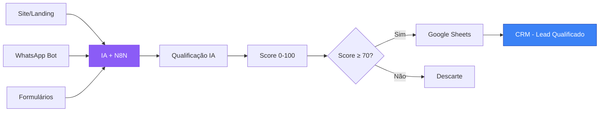
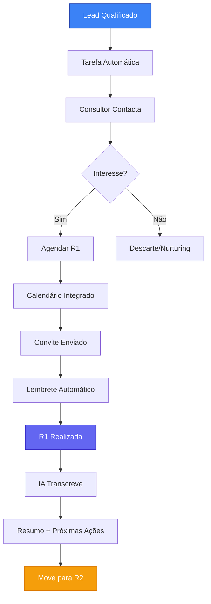
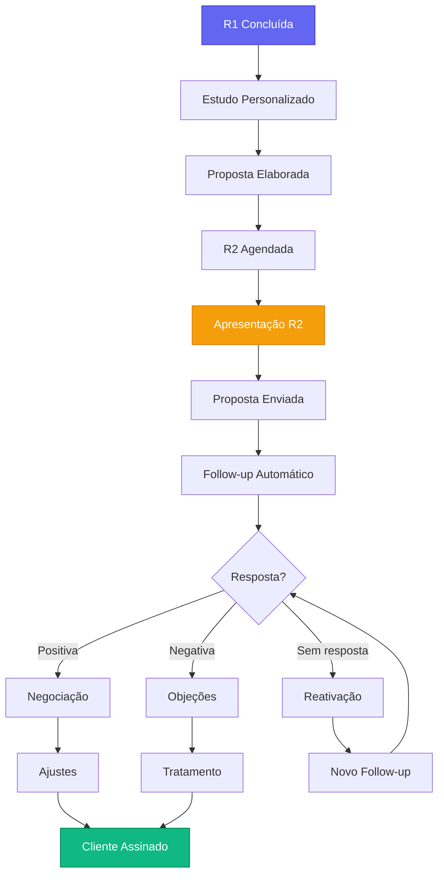
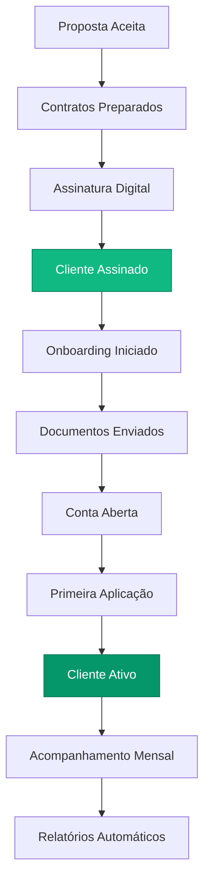
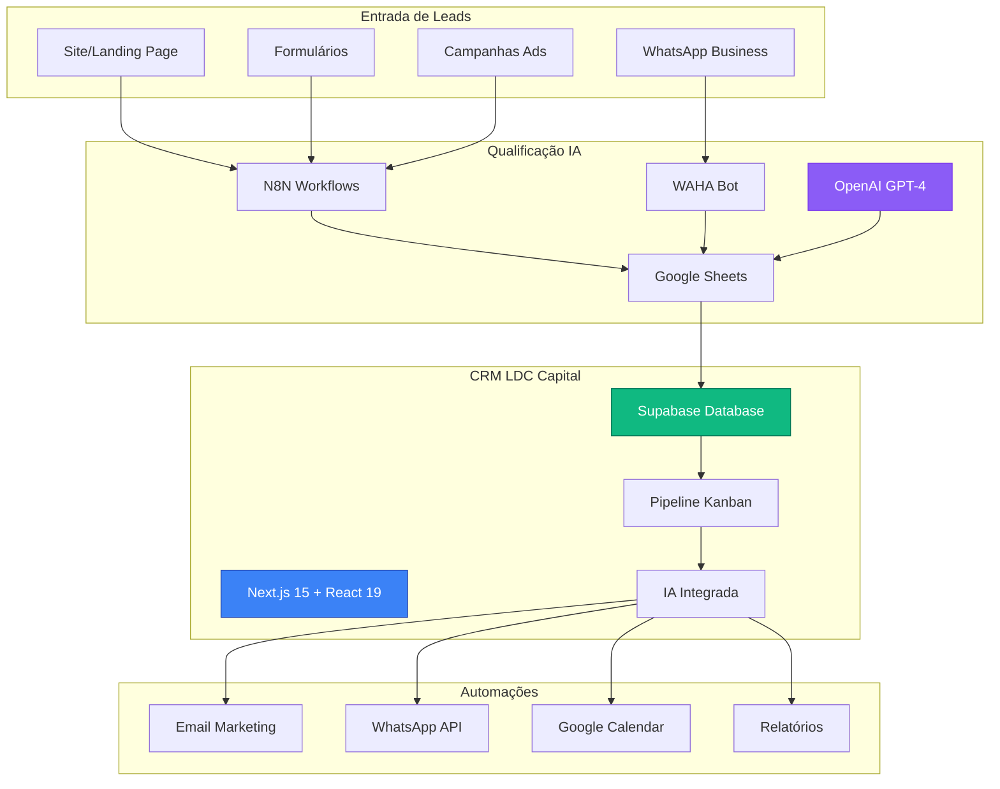

# 🔄 FLUXOGRAMA COMPLETO - CRM LDC CAPITAL

## 📋 VISÃO GERAL DO SISTEMA

### **Processo de Aquisição LDC - 4 Fases Otimizadas**



---

## 🎯 FASE 1: QUALIFICAR

### **🤖 Automação Completa**

#### **Entrada de Leads**


#### **Processo Automático**
1. **Lead chega** via site, WhatsApp, formulário
2. **IA analisa** dados e comportamento
3. **N8N processa** e qualifica
4. **WAHA integra** WhatsApp
5. **Google Sheets** recebe dados qualificados
6. **API Auto-Import** (`/api/leads/auto-import`) envia para CRM
7. **Lead aparece** na coluna "Lead Qualificado"

#### **Dados Capturados**
- ✅ Nome completo
- ✅ Email e telefone
- ✅ Score de qualificação (IA)
- ✅ Origem do contato
- ✅ Preferência de contato
- ✅ Notas da qualificação
- ✅ Consultor atribuído (automático)

---

## 📞 FASE 2: AGENDAR R1

### **Primeira Reunião de Diagnóstico**

#### **Fluxo da R1**


#### **Automações da R1**
1. **Tarefa criada** automaticamente para consultor
2. **Primeiro contato** em até 24h
3. **Calendário integrado** (Google Calendar)
4. **Lembretes automáticos** 1h antes
5. **Gravação + transcrição** via IA
6. **Resumo automático** pós-reunião
7. **Próximas ações** sugeridas

#### **Objetivos da R1**
- 🎯 **Diagnóstico** completo do cliente
- 💰 **Mapeamento** de patrimônio atual
- 🎯 **Identificação** de objetivos
- ⚠️ **Descoberta** de dores/problemas
- 📊 **Perfil** de risco definido

---

## 📋 FASE 3: MARCAR R2 + PROPOSTA

### **Estudo + Proposta + Follow-up**

#### **Fluxo da R2**


#### **Entre R1 e R2**
1. **Análise** dos dados coletados na R1
2. **Estudo personalizado** elaborado
3. **Proposta** de investimentos criada
4. **Simulações** de rentabilidade
5. **R2 agendada** para apresentação

#### **Automações R2**
- 📧 **Email de follow-up** 2 dias após envio
- 📱 **WhatsApp** personalizado
- 🔄 **Lembretes** automáticos
- 📊 **Tracking** de engajamento
- 🤖 **IA sugere** próximas ações

---

## ✍️ FASE 4: ASSINAR

### **Fechamento + Onboarding**

#### **Fluxo de Fechamento**


#### **Automações do Fechamento**
1. **Email de parabéns** + boas-vindas
2. **Checklist** de onboarding criado
3. **Tarefas automáticas** para consultor
4. **Documentos** enviados automaticamente
5. **Follow-up** primeira semana
6. **Relatório** mensal agendado

---

## 🔧 INTEGRAÇÕES TÉCNICAS

### **Arquitetura do Sistema**



### **APIs e Endpoints**

#### **Endpoints Principais**
- `POST /api/leads/auto-import` - Receber leads qualificados
- `GET /api/leads` - Listar leads por consultor
- `PUT /api/leads/{id}` - Atualizar status do lead
- `POST /api/meetings` - Agendar reuniões
- `POST /api/transcribe` - Transcrever áudios

#### **Integrações Externas**
- **Google Calendar API** - Agendamento automático
- **OpenAI API** - Transcrição e análise
- **WhatsApp Business API** - Comunicação
- **N8N Webhooks** - Automações
- **Google Sheets API** - Importação de dados

---

## 📊 MÉTRICAS E KPIs

### **Funil de Conversão**

```mermaid
funnel
    title Funil de Conversão LDC
    "Leads Recebidos" : 1000
    "Leads Qualificados" : 300
    "R1 Agendadas" : 150
    "R2 Realizadas" : 75
    "Clientes Assinados" : 25
```

### **KPIs por Fase**

| Fase | Métrica Principal | Meta |
|------|------------------|------|
| **Qualificar** | Taxa de Qualificação | 30% |
| **R1** | Taxa de Agendamento | 50% |
| **R2** | Taxa de Apresentação | 50% |
| **Assinar** | Taxa de Fechamento | 33% |

### **Automações por Fase**

| Fase | Automações Ativas | Tempo Economizado |
|------|------------------|-------------------|
| **Qualificar** | 100% automático | 8h/dia |
| **R1** | Lembretes + Transcrição | 2h/lead |
| **R2** | Follow-ups + Tracking | 1h/lead |
| **Assinar** | Onboarding + Docs | 3h/cliente |

---

## 🚀 BENEFÍCIOS DO NOVO PROCESSO

### **Para Consultores**
- ✅ **70% menos tempo** administrativo
- ✅ **Leads pré-qualificados** chegam prontos
- ✅ **Automações** cuidam do follow-up
- ✅ **IA sugere** próximas ações
- ✅ **Foco total** no relacionamento

### **Para a LDC Capital**
- 📈 **40% mais conversões** esperadas
- ⚡ **Processo padronizado** e escalável
- 🎯 **Zero leads perdidos** por esquecimento
- 📊 **Métricas precisas** em tempo real
- 🤖 **Operação semi-automatizada**

### **Para os Clientes**
- 🚀 **Resposta rápida** (menos de 24h)
- 🎯 **Atendimento personalizado** via IA
- 📞 **Reuniões bem estruturadas**
- 📋 **Propostas sob medida**
- ⭐ **Experiência consistente**

---

## 🔄 FLUXO COMPLETO RESUMIDO

```
🤖 IA Qualifica → 📊 Google Sheets → 🔄 N8N → ✅ Lead Qualificado
    ↓
📞 R1 (Diagnóstico) → 🤖 IA Transcreve → 📋 Resumo + Ações
    ↓  
📊 Estudo Elaborado → 📋 R2 (Proposta) → 🔄 Follow-up Automático
    ↓
✍️ Assinatura → 🎉 Cliente Ativo → 📊 Acompanhamento Mensal
```

---

**🏆 Resultado Final:** Um CRM sem fricção, altamente automatizado, focado no processo específico da LDC Capital, que maximiza conversões e minimiza tempo administrativo dos consultores.

*Documento atualizado: Janeiro 2024*  
*Versão: 2.0 - Processo LDC Otimizado*

